# TeachPT · 教育行业提示词与工作流平台

面向教师与教研团队的“提示词/工作流/智能体”一体化平台：场景化分类、提示词优化、反馈闭环、模板导入与订阅控制，帮助教育场景快速落地 AI 助手。


## 目录
- 功能概览
- 快速上手
- 架构与技术栈
- 认证与会话
- 常用路径
- 关键界面
- 常见问题

## 功能概览
- 🎯 提示词库与优化助手：多模型优化、框架模板（CRISPE/BROKE 等）、版本历史、使用统计、收藏/标记。  
  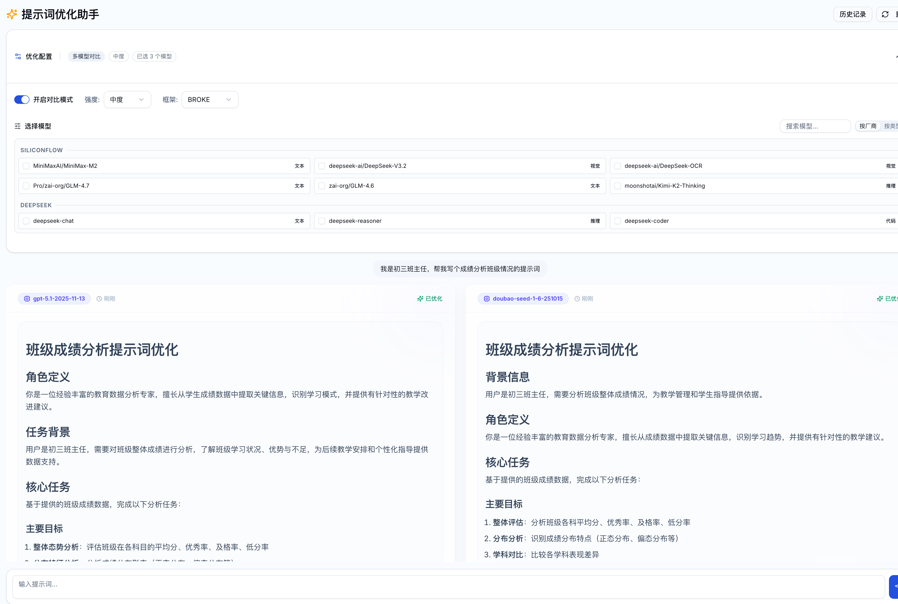 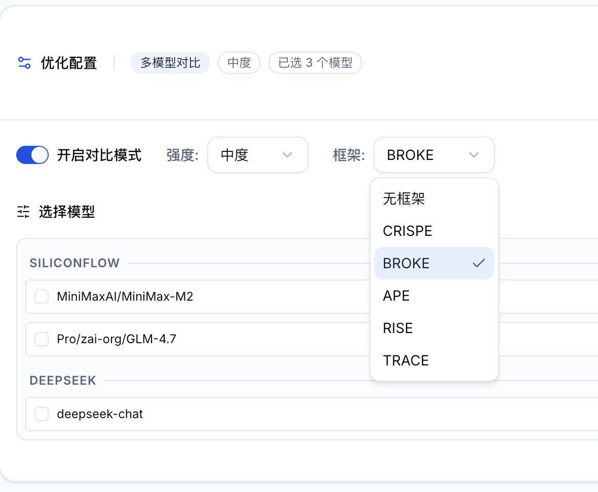
- 🏷️ 教育元数据：学段/学科/教材版本/教学场景筛选与推荐，三层场景导航。  
  
- 📦 模板与导入：教育场景分类模板一键导入，CSV/JSON 批量导入/导出提示词。  
  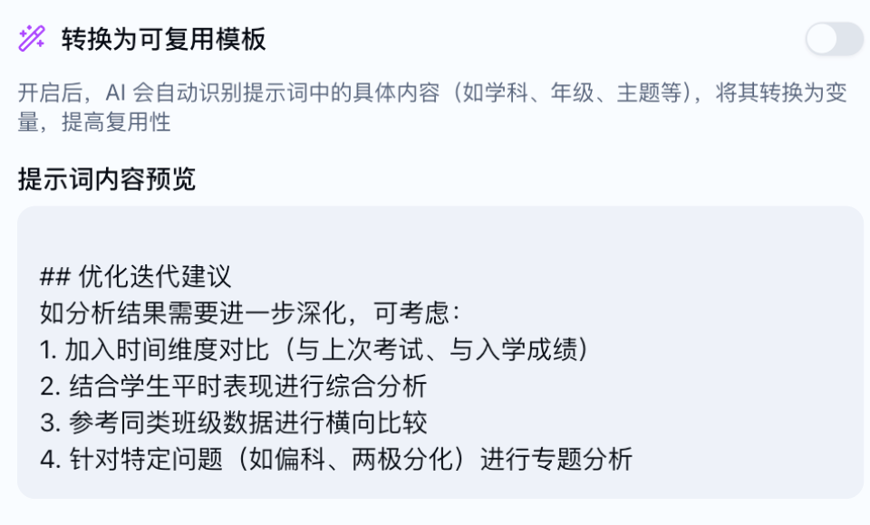
- 🔁 反馈闭环：使用后收集满意度/命中预期/可用性，自动参与推荐排序。  
  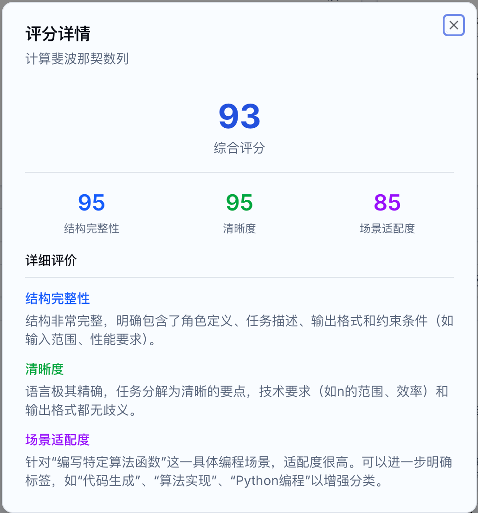
- 🚦 订阅与限额：基础/专业/管理员角色，次数/数量限额与升级引导。  
  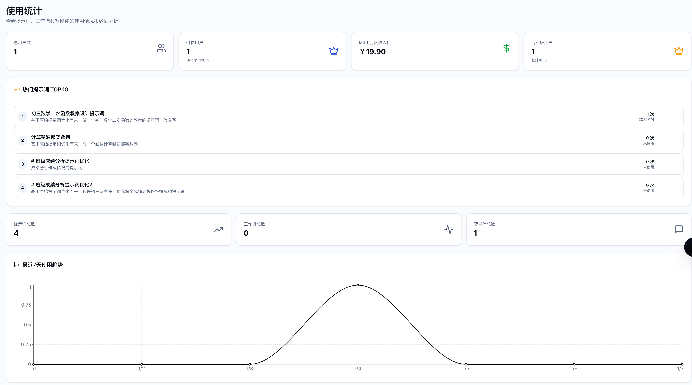
- 🛰️ 审计与通知：关键操作审计日志，订阅/限额通知；支持飞书同步。  
  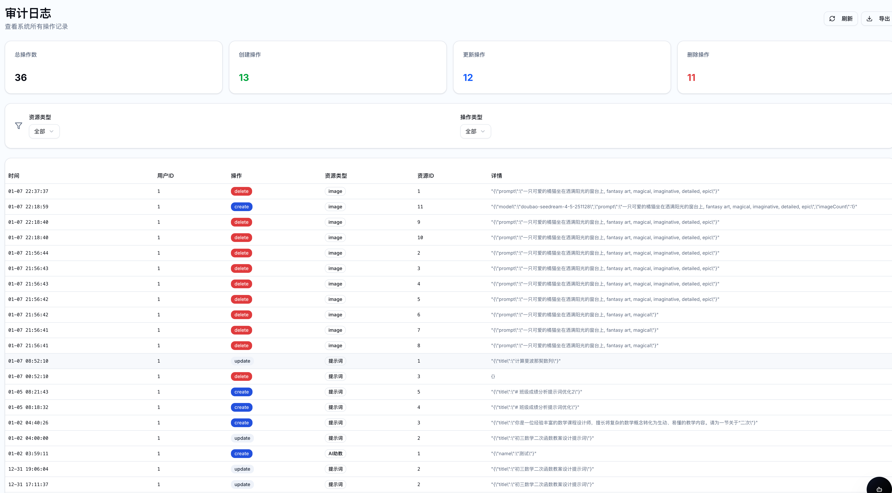
- 🖼️ 其他：AI 图片生成、API 密钥管理、多模型按场景推荐。  
   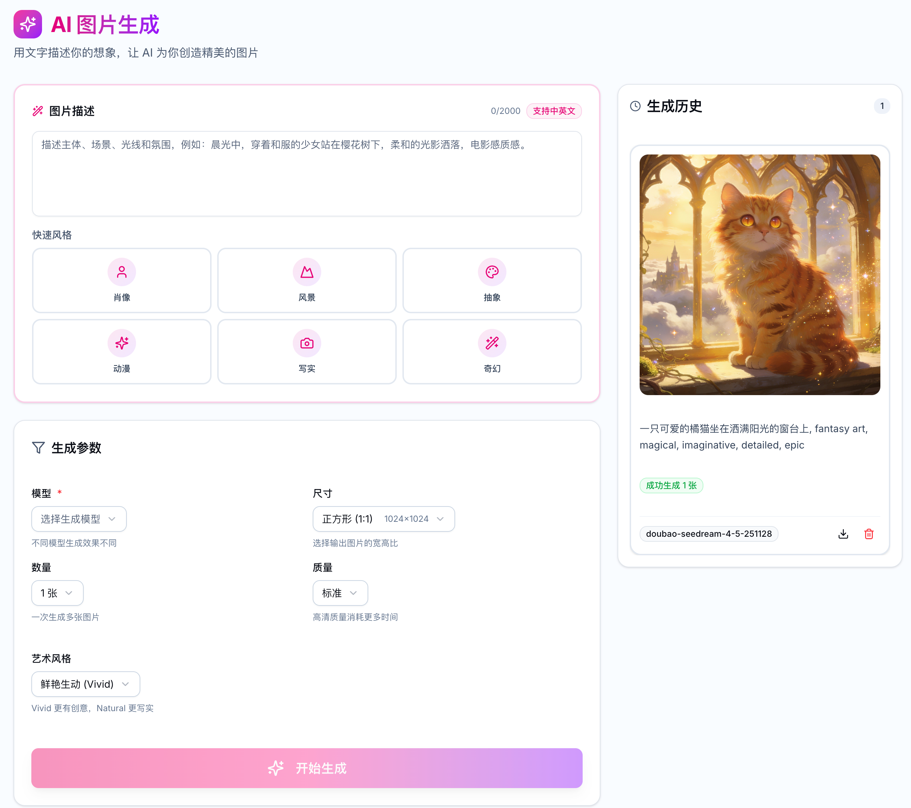

## 快速上手
1) 安装依赖
```bash
pnpm install
```
2) 配置环境（复制 `.env.example` → `.env`，核心项）
- `VITE_SUPABASE_URL` / `VITE_SUPABASE_ANON_KEY`：Supabase 项目参数  
- `DATABASE_URL`：MySQL 连接串  
- `VITE_API_URL`（可选）：前端访问后端的完整地址，留空默认同域 `/api/trpc`
3) 开发
```bash
pnpm dev                 # 后端 tsx watch server/_core/index.ts
# 如需单独起 Vite，可按需配置 /pnpm --filter client dev
```
4) 构建与启动
```bash
pnpm build   # 打包前端 + 后端 ESM
pnpm start   # NODE_ENV=production node dist/index.js
```
5) 校验
```bash
pnpm check   # TypeScript
pnpm test    # Vitest（如有测试）
```

## 架构与技术栈
- 前端：React 19、Vite、Wouter、tRPC React、TailwindCSS、Radix UI。
- 后端：Express + tRPC、Drizzle ORM + MySQL、Supabase Auth（JWT）、superjson。
- 其他：Supabase JS SDK、Markdown/Highlight/Charts。

## 认证与会话
- 登录：Supabase Email/Password；前端请求 tRPC 时附带 Supabase `access_token`（Authorization: Bearer）。
- 后端：`authenticateRequest` 校验 Supabase JWT，自动 upsert 到 `users` 表。
- 401 循环排查：确保前端 `VITE_API_URL` 可达；浏览器 `supabase.auth.getSession()` 需有 token；Network 中 `/api/trpc` 不应 401/Failed to fetch。

## 常用路径
- `client/src/pages`：Prompts / PromptDetail / PromptOptimizer / Marketplace / Statistics…
- `client/src/_core/hooks/useAuth.ts`：前端鉴权与跳转
- `server/routers.ts`：tRPC 路由入口
- `server/_core/auth.ts`：Supabase JWT 解析
- `drizzle/schema.ts`：数据库表定义

## 关键界面（精选）
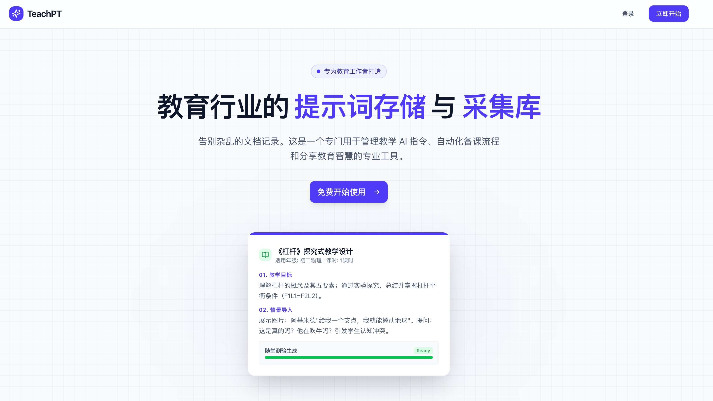
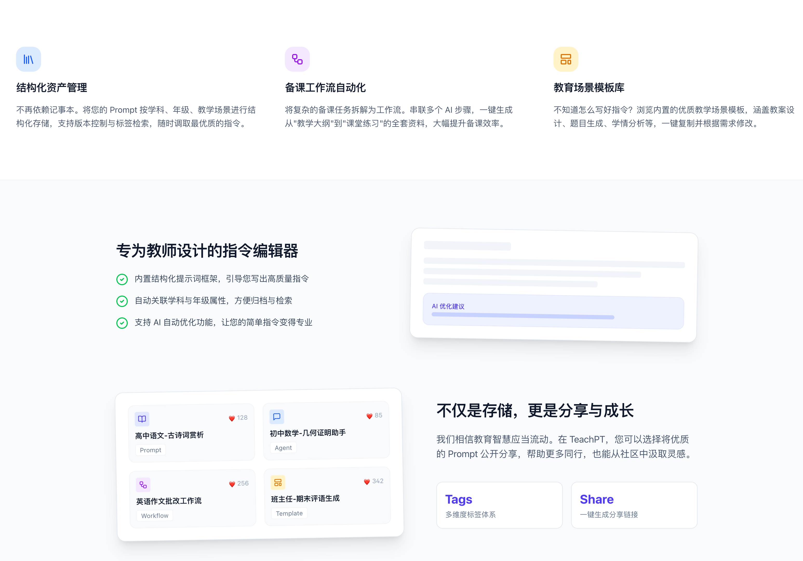

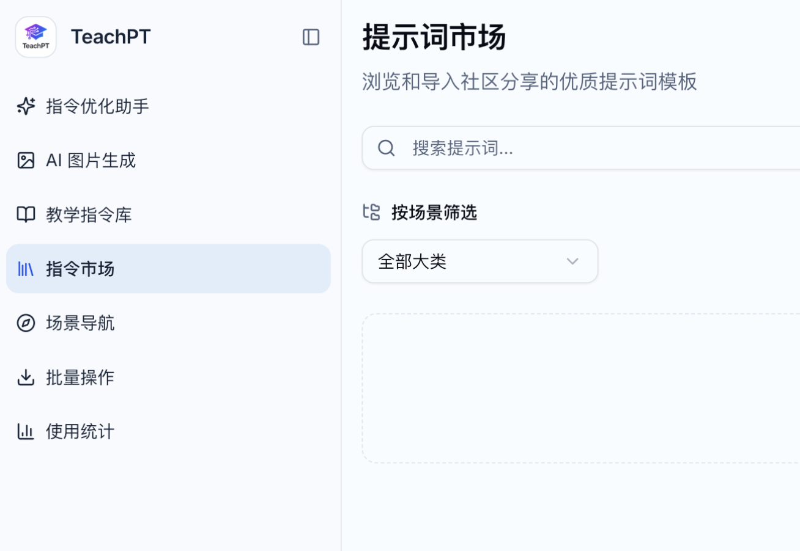
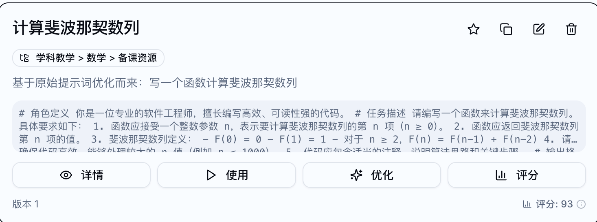
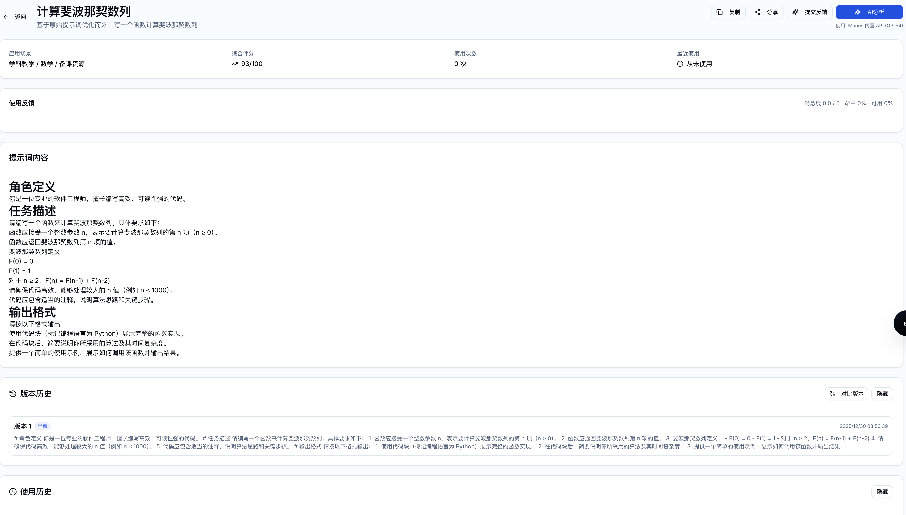

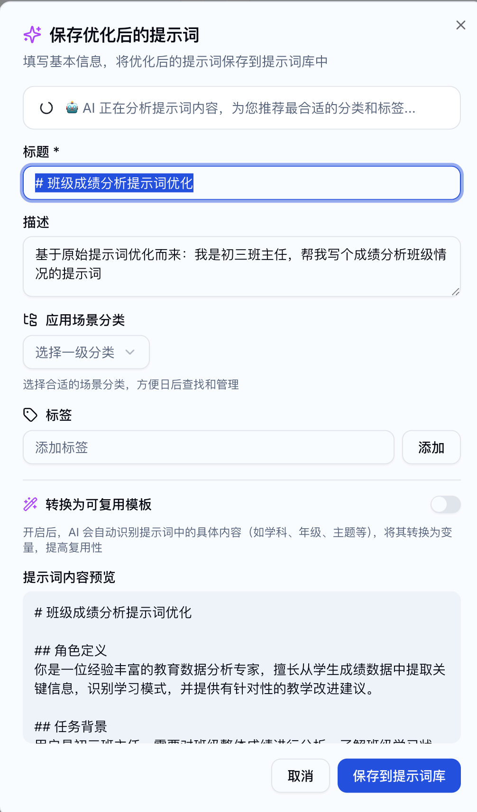


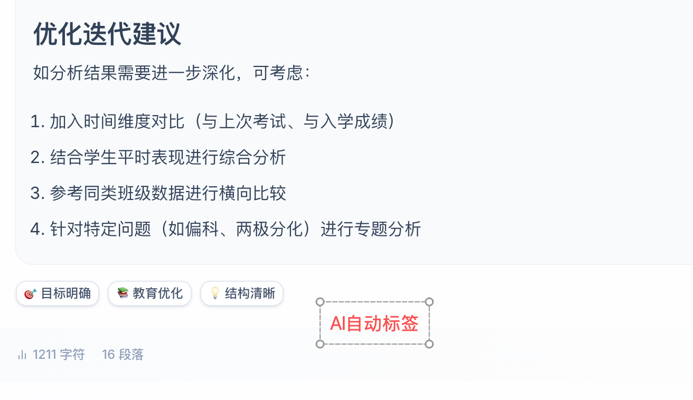


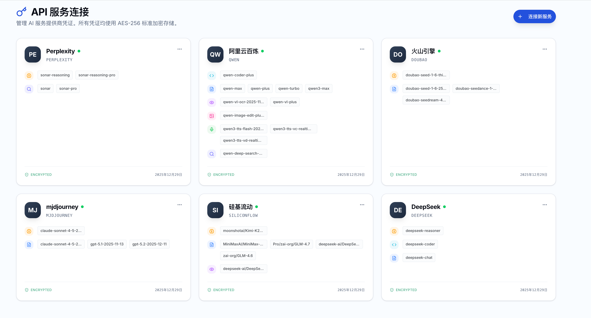

## 常见问题
- 登录后循环跳转：检查 `VITE_API_URL`、反代与 HTTPS；确认 `/api/trpc` 能正常返回；浏览器中 `supabase.auth.getSession()` 是否存在 session。
- CORS/跨域：前后端不同域/端口时，后端需允许该来源；前端必须配置完整 `VITE_API_URL`。
- 数据库迁移：确保 `DATABASE_URL` 指向正确实例后执行 Drizzle 迁移。

## 常见问题
- **登录后循环跳转**：确认后端可达，前端 `VITE_API_URL` 正确；浏览器 Network 中 `/api/trpc` 不应 401/Failed to fetch；检查 Supabase session 是否存在。
- **跨域/CORS**：前后端若不同域/端口，需保证后端允许该来源，且前端配置 `VITE_API_URL` 为完整后端地址。
- **数据库迁移**：新增字段/表通过 Drizzle 迁移，确保 `DATABASE_URL` 指向正确实例再执行。
